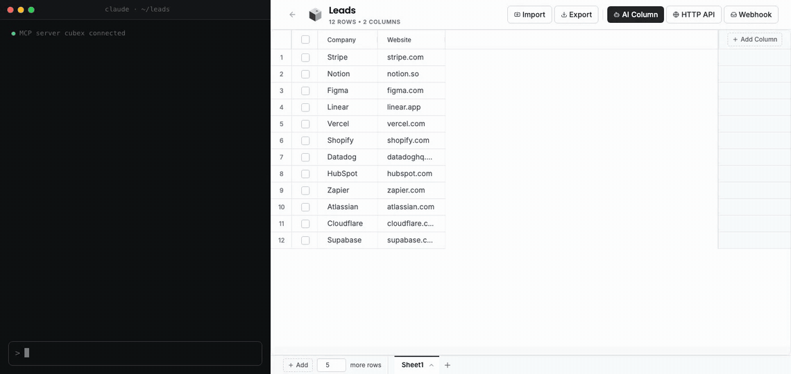
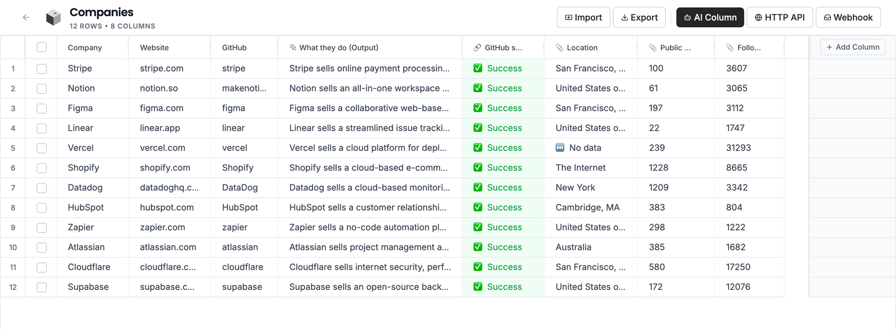
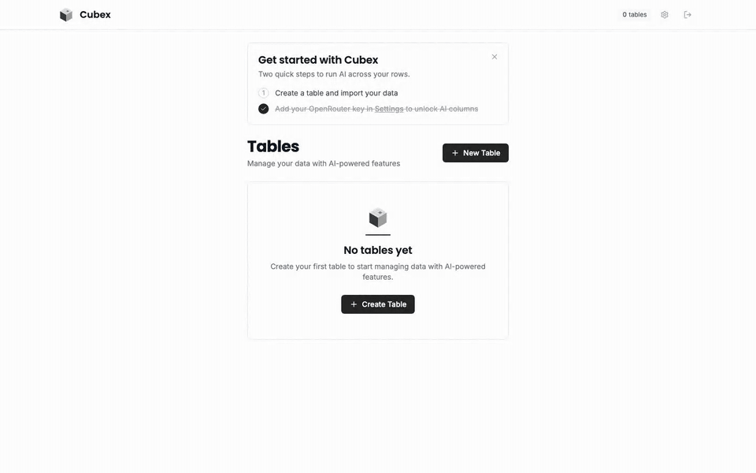
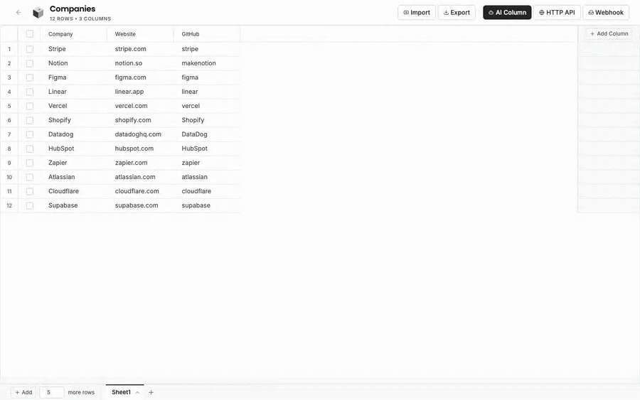
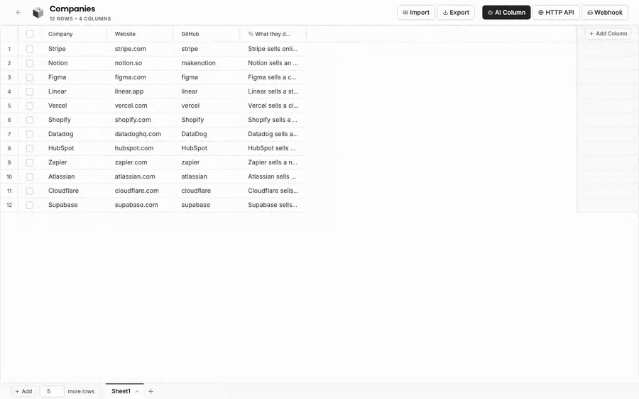
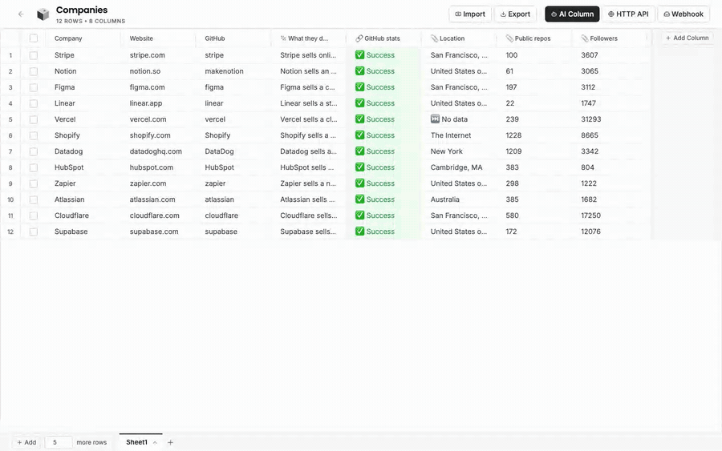
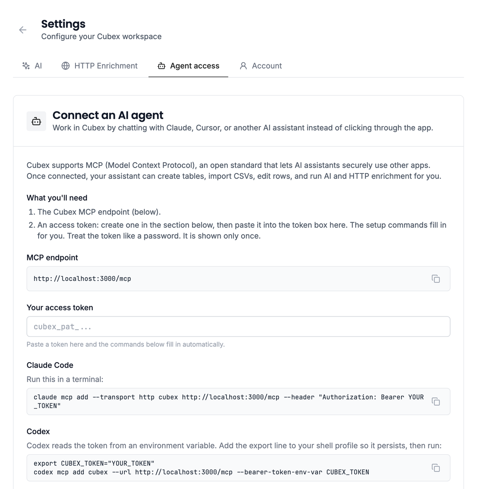

# Cubex

**A self-hosted alternative to [Clay](https://www.clay.com) that your AI agent can run for you.** A spreadsheet where a column can be an AI prompt or an API call, run with your own [OpenRouter](https://openrouter.ai) key instead of credits. Connect Claude Code, Cursor, Codex or Claude Desktop over MCP and ask for the work in plain words.



Import a CSV, then add columns that fill themselves row by row: ask a model about each company, call an enrichment API with each email, or let a webhook append new rows as events arrive. Do it by clicking in the browser, or tell your agent:

> "Import leads.csv into a new table called Leads. Add an AI column that scores each company 1 to 10 for fit, using /company and /domain. Try it on 5 rows, show me the results, then run it on the rest and tell me how many scored 8 or more."

- **Agent access (MCP).** Your agent can create tables, import and export CSVs, edit rows, and start, pause and re-run AI and HTTP runs. Each access token gets only the scopes you give it, so an agent can be read-only. There's also a REST API.
- **AI columns.** Write a prompt that references other columns (`Score /company 1-10 for fit`). Runs on any of 300+ models through your own [OpenRouter](https://openrouter.ai) key. Through the API or MCP, one run can fill several typed columns at once (a score and the reason for it).
- **HTTP API columns.** Call any JSON API once per row with values from the row (`https://api.example.com/people?email={{email}}`), then pick fields from the response to become columns.
- **Webhooks.** Give a sheet a secret URL; every JSON event POSTed to it becomes a new row.
- **A real spreadsheet underneath.** Multiple sheets per table, CSV import and export, sort, filters, live progress while runs fill cells, pause and resume.

Your data stays in one SQLite file on your machine. The server only calls out to OpenRouter for AI columns (including its price list for web search engines) and to the APIs you put in HTTP columns. (The web page loads its fonts from Google Fonts.)

## Install

On macOS or Linux (on Windows, inside WSL2), run:

```bash
curl -fsSL https://raw.githubusercontent.com/gurmohitghuman/cubex/main/install.sh | bash
```

The install takes a minute or two and needs about 1.5 GB of free memory while it builds. Everything goes into `~/.cubex`: a private copy of Node.js (your own Node, if you have one, is never used or changed), Cubex itself, your data and a settings file.

Only this computer can open Cubex until you change that. To use it from other devices on your network, install with `--public`: Cubex then listens on every network interface, and the installer generates your password and prints it. On a server that's reachable from the internet, keep the default instead and put HTTPS in front (step by step: [Run Cubex on your own server](docs/self-hosting.md)).

```bash
curl -fsSL https://raw.githubusercontent.com/gurmohitghuman/cubex/main/install.sh | bash -s -- --public
```

It installs the latest [release](https://github.com/gurmohitghuman/cubex/releases); `--ref main` follows the newest code instead. Other options include `--port` and `--dir` (install somewhere other than `~/.cubex`); `--help` lists them all. Prefer Coolify, Docker or running from a checkout? See [Other ways to run Cubex](#other-ways-to-run-cubex).

## Run

Open http://localhost:3002. **Whoever opens Cubex first chooses the password,** unless `INITIAL_PASSWORD` is set (`--public` sets it for you). There's one account and no email, so there's no reset link either. If you forget the password, run `cubex reset-password` on the computer Cubex runs on. Changing or resetting the password signs out every browser.

To use AI columns, create an API key at [openrouter.ai/keys](https://openrouter.ai/keys) (OpenRouter bills you directly for what your runs use), then add it and pick a default model in **Settings → AI**. Cubex never picks a model for you.

Cubex keeps running in the background and comes back after a restart: on macOS when you log in, on Linux when the computer starts (if the installer can't set that up, it tells you the one command that does). Everything else goes through the `cubex` command:

| Command | What it does |
|---|---|
| `cubex status` | Whether Cubex is running, its address and version |
| `cubex open` | Open Cubex in your browser |
| `cubex stop`, `cubex start`, `cubex restart` | Stop, start or restart it |
| `cubex logs` | Follow the server log |
| `cubex update` | Update to the latest release; your data and settings are kept |
| `cubex config` | Show the settings file, `~/.cubex/config.env` |
| `cubex reset-password` | Choose a new password |
| `cubex uninstall` | Remove Cubex but keep your data (`--delete-data` removes that too) |

## How it works



**Import.** Create a table, then import a CSV or start typing. A sheet holds up to a million rows.



**AI column.** Click **AI Column**, name it, and write what you want. Type `/` to reference another column; its value is filled in for each row. Try it on 5 rows first, check the results, then run it on the whole sheet. Turn on web search or "fetch URLs from referenced columns" when the model needs current information. With web search on, pick the search engine and limit the searches per row (search fees are usually most of the cost); each row's "(Data)" cell shows what it searched for and what it cost. Runs can be paused, resumed, stopped, and re-run on only the rows that failed or came back empty.



**HTTP API column.** Click **HTTP API** and describe the request: method, URL, headers and body. `{{column}}` (or `/column`) inserts the row's value. Save API keys under **Settings → HTTP Enrichment** and reference them the same way by name, for example `Authorization: Bearer {{apollo_key}}`. Saved keys are stored encrypted and never shown again. Preview on a few rows, then click the response fields you want as columns. A few rules:

- Responses must be JSON. HTML pages are rejected, so this isn't a scraper.
- Requests can't reach private or internal addresses (localhost, your LAN, cloud metadata), so a value that came in through a webhook or an AI answer can't point Cubex at your own network.
- A run makes up to 20 requests at a time (configurable).



**Webhook.** Open a sheet and click **Webhook**, or let it create a table of its own. Send one test event and click the fields you want as columns; every event after that becomes a row with those fields filled in. See [docs/webhooks.md](docs/webhooks.md).



**Agents (MCP).** Create an access token in **Settings → Agent access**. The page shows the setup command for your agent with your address and token filled in. For Claude Code it's one line:

```bash
claude mcp add --scope user --transport http cubex http://localhost:3002/mcp --header "Authorization: Bearer cubex_pat_..."
```

Then ask for the work in chat:

- "Call `https://api.example.com/people?email={{email}}` for each row and add the job title and LinkedIn URL as columns."
- "The last run left some cells blank. Show me why, then re-run only those rows."
- "Export the rows where Status is Qualified, with just Email and Company."

Give each token only the scopes it needs: `read`, `write`, `run` (starts runs, which spend your OpenRouter credits) and `secrets` (HTTP runs that use your saved API keys). Setup for Cursor, Codex, VS Code and Claude Desktop, and the full list of tools, is in [docs/mcp.md](docs/mcp.md).



## Configuration

Everything is optional. Settings live in `~/.cubex/config.env`, one `KEY=value` per line; after a change, run `cubex restart`.

| Variable | Default | What it does |
|---|---|---|
| `PORT` | `3002` | Port Cubex listens on. |
| `HOST` | `127.0.0.1` | Who can open Cubex. `127.0.0.1`: only this computer. `0.0.0.0`: any device that can reach it. |
| `DB_PATH` | `~/.cubex/data/cubex.db` | The database. Its directory also holds `jobs.db` and the generated secrets. |
| `INITIAL_PASSWORD` | (none) | Creates the account with this password on first boot, so a public install can't be claimed by whoever finds it first. Ignored once the account exists. |
| `PUBLIC_URL` | (none) | The address webhook senders and agents' file links use, if it differs from the one you browse on. |
| `MAX_ROWS_PER_SHEET` | `1000000` | Rows per sheet. |
| `MAX_COLUMNS_PER_SHEET` | `200` | Columns per sheet. |
| `MAX_CSV_UPLOAD_MB` | `500` | Largest CSV you can import. |
| `HTTP_MAX_CONCURRENCY` | `20` | Most concurrent requests one HTTP run makes. |
| `SIDEQUEST_MAX_CONCURRENT_JOBS` | `4` | AI and HTTP runs that execute at once; more wait in line. |
| `LOGIN_RATE_MAX` | `10` | Failed sign-ins allowed per 15 minutes, for the whole instance. |
| `MCP_EFFICIENT_ROWS_ENABLED` | off | Set to `1` to give agents the `transfer_rows` and `transform_column` tools. |
| `JWT_SECRET`, `APP_ENCRYPTION_KEY` | generated | Created on first boot. Set them only to manage them yourself. |

There are no limits on tables or sheets. A million rows per sheet runs comfortably on an ordinary server: the grid loads rows as you scroll, and the big jobs (import, sort, renaming or deleting a column, AI and HTTP runs) work through the sheet in small batches, so memory stays low and Cubex keeps answering while they run. Measured numbers are under [Performance](#performance).

## Performance

Measured on one sheet with 1,000,000 rows and 10 columns (a 160 MB CSV), on an Apple M4 laptop with 16 GB of memory that was busy with other work. A small VPS takes longer on the big jobs, but the waits stay short because those jobs work in batches. "Others waited" is the longest any other request had to wait while the action ran.

| Action | Time | Others waited | Peak memory |
|---|---|---|---|
| Import the CSV | 24 s | 0.1 s | 420 MB |
| Open the sheet | 0.07 s | none | 300 MB |
| Scroll to the middle or the end | 0.1 to 0.2 s | none | 480 MB |
| Edit a cell | 0.05 to 0.1 s | none | 490 MB |
| Filter a column by "contains" | 0.6 s | none | 560 MB |
| Add a column | 0.05 s | none | 510 MB |
| Rename a column | 5 s | 0.07 s | 620 MB |
| Delete a column | 0.8 s | 0.02 s | 890 MB |
| Sort every row by a column | 24 s | 0.15 s | 680 MB |
| Export to CSV | 2.7 s | 0.04 s | 590 MB |
| Receive a webhook (adds row 1,000,001) | 0.08 s | 0.04 s | 850 MB |
| Start an HTTP run on every row | answers in 0.1 s; the run starts 2.8 s later | 0.08 s | 890 MB |
| Stop that run | answers in 0.03 s; leftover cells clear 3.2 s later | 0.04 s | 620 MB |

The database for this sheet is 600 MB on disk.

While a big job (import, sort, column rename or delete, preparing a run's rows) works on a sheet, other changes to that sheet wait for it: your cell edits stay queued and save when it finishes, and anything else gets a "this sheet is busy" message. Other sheets are not affected. If Cubex stops in the middle of one of these jobs, it finishes it (or, for an import, removes the partly imported rows) the next time it starts.

## Your data and backups

Everything Cubex keeps lives in one directory, `~/.cubex/data`:

| File | What it is |
|---|---|
| `cubex.db` | Your tables, settings and encrypted keys. |
| `jobs.db` | The run queue, so runs survive a restart. |
| `.jwt-secret` | Signs sign-in sessions. |
| `.encryption-key` | Encrypts your OpenRouter key, saved API keys and webhook URLs. |
| `uploads/` | CSV files while they import. Emptied when Cubex starts; no need to back it up. |

Back up the whole directory together. **If `.encryption-key` is lost, saved keys can't be decrypted** and have to be entered again. To take a consistent snapshot while Cubex is running, use `scripts/backup-cubex-db.sh` (with the installer: `~/.cubex/app/scripts/backup-cubex-db.sh ~/.cubex/data/cubex.db`). The server guide shows how to [run it every night](docs/self-hosting.md#6-back-up-every-night).

## Putting it on the internet

Cubex is built to run on your own machine or server. **[Run Cubex on your own server](docs/self-hosting.md)** walks through it step by step, from a new Linux server to Cubex on your own domain: DNS, firewall, HTTPS certificate, nightly backups and updates. In short, if Cubex is reachable from the internet (for example so webhooks can arrive):

- Put it behind HTTPS with a reverse proxy (Caddy, nginx, Traefik). The session cookie becomes `Secure` automatically when the proxy sends `X-Forwarded-Proto: https`. Keep the default `HOST=127.0.0.1` and run the proxy on the same server. [Caddy](https://caddyserver.com) gets the certificate for you, and this is its whole Caddyfile:

  ```
  cubex.example.com {
      reverse_proxy 127.0.0.1:3002
  }
  ```
- Set `INITIAL_PASSWORD` so the install is never open for someone else to claim, or choose the password before you open it up.
- Use a strong password. Failed sign-ins are limited for the whole instance (10 per 15 minutes), not per IP: someone hammering the login can delay new sign-ins, but browsers that are already signed in keep working.
- Treat webhook URLs and access tokens like passwords. Both can be rotated or revoked in the app.

For webhooks on a laptop, a tunnel (`cloudflared tunnel`, `ngrok`) works. Set `PUBLIC_URL` to the tunnel address so the app shows the right webhook URL and agents get working file links.

## Other ways to run Cubex

The one-line installer is the easiest way. Everything above also applies to these, apart from where settings and data live and how you reset the password.

### Coolify

If you run [Coolify](https://coolify.io), it can host Cubex with nothing installed on the server by hand:

1. In a project, add a new resource: **Public Repository**, paste this repository's URL, choose the **Docker Compose** build pack, then **Deploy**.
2. When the deploy finishes, open the **Environment Variables** tab and copy `SERVICE_PASSWORD_CUBEX`. That's your password. Coolify generated it before the app went live, so nobody can claim your install before you do.
3. Open the address Coolify gave the app and sign in. You can change the password in **Settings**.

To use your own domain, enter it in the `cubex` service's domain field as `https://cubex.example.com:3002`. The `:3002` only tells Coolify which container port to send traffic to; people still visit `https://cubex.example.com`. The address Coolify generates uses plain HTTP unless your server has a wildcard domain, so set a real domain before you put real data in. Coolify handles HTTPS for you.

The first build needs about 1.5 GB of free memory; on a small server, add swap or use a Coolify build server. Your data lives in the `cubex-data` volume (**Persistent Storage**), which redeploys keep. Settings are under **Environment Variables**: the ones listed in `docker-compose.yaml` are already there, and Coolify passes nothing else to the app. To reset the password, run `npm run reset-password` in the app's **Terminal** tab.

### Docker

```bash
git clone https://github.com/gurmohitghuman/cubex.git && cd cubex
docker compose up -d
```

Open http://localhost:3002 and choose a password. Settings go under `environment:` in `docker-compose.yaml`, your data lives in the `cubex-data` volume, and `docker compose exec cubex npm run reset-password` resets the password.

### From source

Needs Node.js 22.6 or newer.

```bash
git clone https://github.com/gurmohitghuman/cubex.git && cd cubex
npm install
npm run build
NODE_ENV=production npm start
```

Open http://localhost:3002. Settings go in `server/.env` (copy [server/.env.example](server/.env.example)), your data lives in `server/data/`, and `npm run reset-password` resets the password. Unless you set `HOST`, Cubex listens on every network interface here.

## Development

```bash
npm run dev          # client on :3000, server on :3002, both hot-reload
npm run typecheck    # server + client
npm run test:unit    # fast tests, no server
E2E_SPEC=tests/e2e scripts/e2e-harness.sh   # full browser + API suite on a throwaway database
```

The end-to-end suite needs Playwright: `npm install --no-save @playwright/test && npx playwright install chromium`.

How a release is cut: [docs/releasing.md](docs/releasing.md).

Stack: Express and SQLite (better-sqlite3) on the server, React, Vite and AG Grid in the browser, Sidequest for background runs. Runs, autosave and column handling rely on rules that the comments at the top of those files explain; read them before changing anything there.

## License

MIT, see [LICENSE](LICENSE). You're free to use, change and share Cubex however you like.

## About this project

Cubex is a side project I've worked on over the past year. It comes as is, with no warranty and no promise of support. Use it at your own risk, and keep backups of any data you care about (see [Your data and backups](#your-data-and-backups)).
